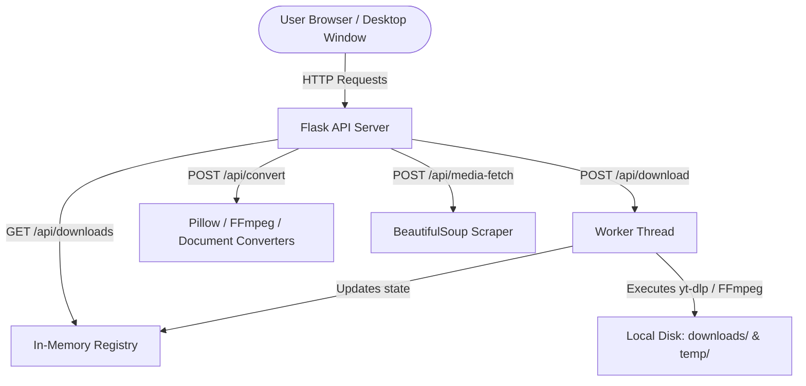

# MediaRift 🚀

MediaRift is a high-performance, private, self-hosted media utility suite. It provides a unified web interface and native desktop window wrapping (via PyWebView) to scrape webpages for media, download video and audio from 1000+ supported websites, and perform lossless transcoding for images, audio, video, and documents.

---

## 📖 Table of Contents
1. [Project Overview](#-project-overview)
2. [Key Features](#-key-features)
3. [Architecture & Flow](#-architecture--flow)
4. [Tech Stack](#-tech-stack)
5. [Setup & Installation](#-setup--installation)
6. [Environment Variables](#-environment-variables)
7. [API Reference](#-api-reference)
8. [Live Deployment](#-live-deployment)

---

## 🌟 Project Overview

MediaRift solves the problem of paid web tools, privacy leakage, and ad-filled wrappers. By packaging industry-standard engines like **yt-dlp**, **FFmpeg**, and **Pillow**, it runs entirely locally (or as a private cloud service) to fetch, convert, and download media. 

It runs in two modes:
1. **Desktop App Mode**: Wrapping the React client and Flask server into a native OS window using PyWebView.
2. **Web Service Mode**: Serving the React client as a standard web application on any modern browser.

---

## ⚡ Key Features

*   **Asynchronous Downloader**: Download high-quality video (up to 4K), audio streams (MP3/M4A), or thumbnails asynchronously. Features pause, resume, cancel, and download history tracking.
*   **Speed & Rate Control**: Set bandwidth limits or trigger **Snail Mode** (throttling to 50 KB/s) to mimic slow connections or avoid platform rate-limits.
*   **Web Asset Scraper**: Point MediaRift at any webpage to scrape and catalog all embedded media assets (JPG, PNG, WebP, GIF, SVG, ICO, MP4, MP3, etc.).
*   **Lossless File Converter**:
    *   **Images**: Flatten transparency and re-encode (JPG, PNG, WebP, BMP, GIF, ICO, AVIF, HEIC).
    *   **Audio/Video**: Transcode container formats and codecs via FFmpeg.
    *   **Documents**: Bidirectional PDF-to-Word (DOCX) and Word-to-PDF conversion (via docx2pdf / pdf2docx) with a pure Python ReportLab fallback layout engine.

---

## 📐 Architecture & Flow

MediaRift utilizes a decoupled client-server architecture that can also be compiled as a single binary using PyInstaller.



### Key Architectural Details:
1.  **Background Processing**: Media downloads are spun off into daemon threads (`threading.Thread`) controlled by a thread-safe registry (`services/download_registry.py`). This keeps the server highly responsive.
2.  **State Polling**: The frontend client queries `/api/downloads` at regular intervals to update progress bars, speeds, ETAs, and active download logs.
3.  **Static Assets**: In production, Flask is configured to serve the prebuilt React static files directly from the `frontend/dist` directory.

---

## 🛠️ Tech Stack

### Frontend Client
*   **Core**: React 19, JavaScript (ES6+), HTML5.
*   **Build Tool**: Vite, Rollup (custom chunk division).
*   **Styling**: CSS Modules (scoped component styling) and custom theme variables.
*   **HTTP Client**: Fetch API & Axios.

### Backend Server
*   **Web Framework**: Flask 3.0, Flask-CORS (Cross-Origin Resource Sharing).
*   **Registry**: Python standard thread-safe dictionaries.
*   **Database**: None (in-memory state + local configuration JSON file).

### Engine Libraries
*   **yt-dlp**: Core engine for parsing media page links and streams.
*   **FFmpeg/FFprobe**: CLI wrapper for video merging and media transcoding.
*   **Pillow**: Image processing, format conversion, and ico generation.
*   **docx2pdf & pdf2docx**: Document parsing and conversion.
*   **ReportLab**: Fallback PDF layout engine when MS Word is unavailable.
*   **PyWebView**: Native window bindings and state preservation.

---

## 🚀 Setup & Installation

### Prerequisites
*   **Python**: 3.10 or higher.
*   **Node.js**: 18.x or higher (with `npm`).
*   **FFmpeg**: Executables must be on your system `PATH` or configured via env variables.

### 1. Download FFmpeg Binaries (Windows only)
For convenience, you can download prebuilt compact binaries directly into a local `bin` folder:
```bash
python download_ffmpeg.py
```

### 2. Backend Setup
1. Navigate to the backend directory:
   ```bash
   cd backend
   ```
2. Create a virtual environment and activate it:
   ```bash
   python -m venv venv
   # On Windows:
   venv\Scripts\activate
   # On macOS/Linux:
   source venv/bin/activate
   ```
3. Install dependencies:
   ```bash
   pip install -r requirements.txt
   ```
4. Copy `.env.example` to `.env` (or configure inline) and adjust the port if needed.

### 3. Frontend Setup
1. Navigate to the frontend directory:
   ```bash
   cd ../frontend
   ```
2. Install dependencies:
   ```bash
   npm install
   ```

### 4. Running the Application locally (Development)
You can start both systems concurrently by running the script at the project root:
*   **Windows**: Run [start_app.bat](file:///c:/Users/oscar/Desktop/MediaRift/start_app.bat)
*   **Manual**:
    *   **Backend**: `cd backend && python app.py` (runs on `http://localhost:5000`)
    *   **Frontend**: `cd frontend && npm run dev` (runs on `http://localhost:5173` with api requests proxied)

---

## ⚙️ Environment Variables

A `.env` file should be placed inside the `backend` folder:

| Variable Name | Description | Default |
| :--- | :--- | :--- |
| `FLASK_ENV` | Run environment (`development` / `production`). | `production` |
| `FLASK_DEBUG` | Toggle debug output and hot reloading. | `false` |
| `SECRET_KEY` | Flask session cryptographic signature key. | `ytshort-secret-change-me` |
| `PORT` | Listening port for the Flask backend. | `5000` |
| `CORS_ORIGINS` | Permitted cross-origin endpoints (comma-separated). | `http://localhost:5173` |
| `FFMPEG_PATH` | Explicit absolute path to `ffmpeg` binary. | *(uses system PATH)* |
| `FFPROBE_PATH` | Explicit absolute path to `ffprobe` binary. | *(uses system PATH)* |
| `COOKIES_FILE` | Optional path to Netscape-format youtube cookies file. | *(none)* |
| `PROXY` | Proxy server for yt-dlp requests (e.g., `socks5://...`). | *(none)* |
| `MAX_DOWNLOAD_SIZE`| Maximum filesize allowed for downloads (in bytes). | `4294967296` (4 GB) |
| `YTDLP_TIMEOUT` | Timeout limit (seconds) for active download streams. | `600` (10 minutes) |
| `TEMP_FILE_TTL` | Duration (seconds) before cleanup sweeps delete temp files.| `3600` (1 hour) |

---

## 🔌 API Reference

All requests must have the prefix `/api`.

### 1. Media Info
*   **URL**: `/info`
*   **Method**: `POST`
*   **Body**:
    ```json
    { "url": "https://www.youtube.com/watch?v=..." }
    ```
*   **Response (200 OK)**:
    ```json
    {
      "success": true,
      "data": {
        "title": "Video Title",
        "thumbnail": "https://...",
        "formats": [...],
        "duration": 240
      }
    }
    ```

### 2. Start Download
*   **URL**: `/download`
*   **Method**: `POST`
*   **Body**:
    ```json
    {
      "url": "https://www.youtube.com/watch?v=...",
      "format_id": "137+140",
      "download_type": "video",
      "quality_label": "1080p",
      "thumbnail_ext": "jpg"
    }
    ```
*   **Response (202 Accepted)**:
    ```json
    { "success": true, "id": "uuid-string-here" }
    ```

### 3. List/Get Downloads
*   **URL**: `/downloads` | `/downloads/<entry_id>`
*   **Method**: `GET`
*   **Response (200 OK)**:
    ```json
    {
      "success": true,
      "data": [
        {
          "id": "uuid-string",
          "url": "https://...",
          "state": "downloading",
          "percent": 45,
          "speed_bps": 204800,
          "eta_seconds": 15
        }
      ]
    }
    ```

### 4. Control Download Task
*   **URL**: `/downloads/<entry_id>/pause` | `/downloads/<entry_id>/resume` | `/downloads/<entry_id>/stop`
*   **Method**: `POST`
*   **Response (200 OK)**:
    ```json
    { "success": true }
    ```

### 5. Fetch Scraped Page Media
*   **URL**: `/media-fetch`
*   **Method**: `POST`
*   **Body**:
    ```json
    { "url": "https://example.com" }
    ```
*   **Response (200 OK)**:
    ```json
    {
      "success": true,
      "data": [
        {
          "url": "https://example.com/logo.png",
          "type": "image",
          "ext": ".png",
          "filename": "logo.png",
          "width": 512,
          "height": 512,
          "size_bytes": 45100
        }
      ]
    }
    ```

### 6. Transcode/Convert File
*   **URL**: `/convert`
*   **Method**: `POST`
*   **Content-Type**: `multipart/form-data`
*   **Parameters**:
    *   `file`: *(Binary file payload)*
    *   `toFormat`: Target extension suffix (e.g. `png`, `mp3`, `pdf`, `docx`)
*   **Response (200 OK)**:
    *   Streams back the raw converted file payload.

### 7. App Settings
*   **URL**: `/settings`
*   **Method**: `GET` (fetch) | `POST` (update)
*   **Body (POST)**: Partial settings patch dictionary.
*   **Response (200 OK)**:
    ```json
    { "success": true, "data": { "theme": "dark", "snail_mode": false } }
    ```

### 8. Health Check
*   **URL**: `/health`
*   **Method**: `GET`
*   **Response (200 OK)**:
    ```json
    {
      "status": "ok",
      "dependencies": {
        "ffmpeg": { "available": true, "version": "4.4.1" },
        "ytdlp": { "available": true, "version": "2024.03.10" }
      }
    }
    ```

---

